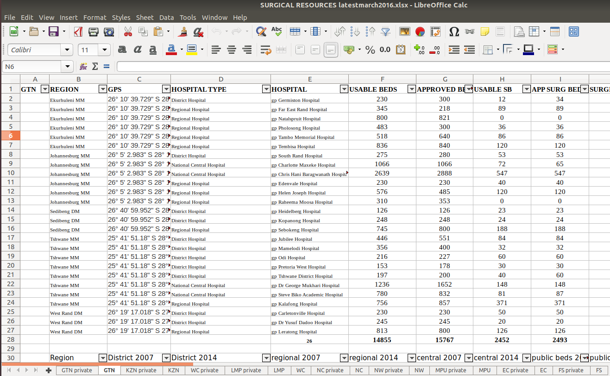
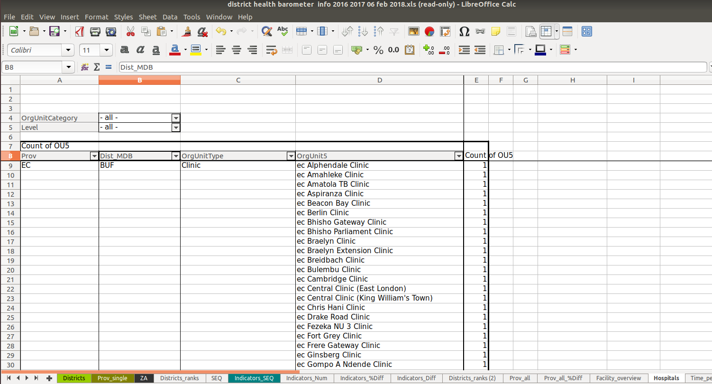
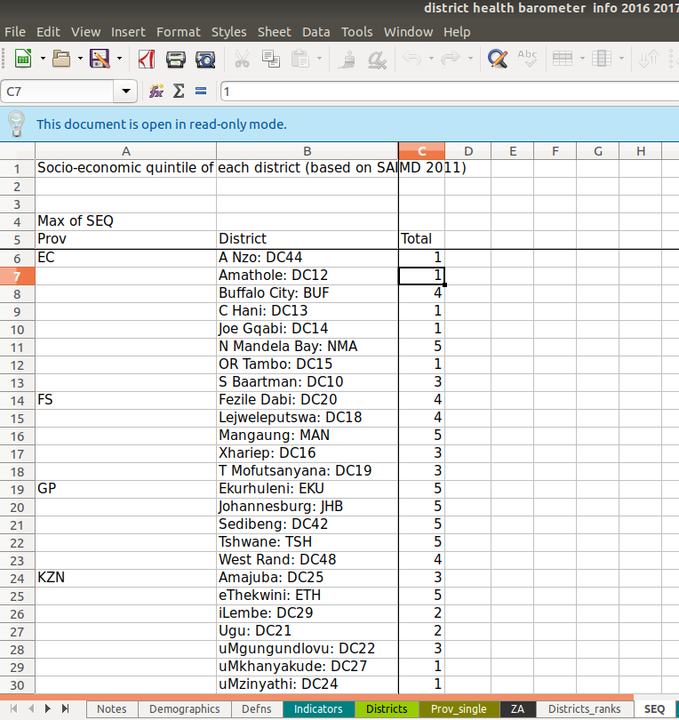
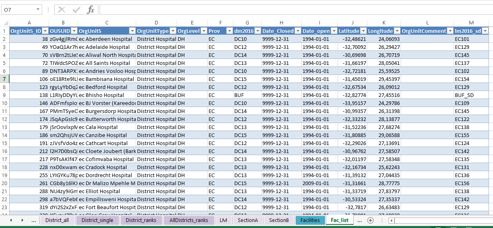
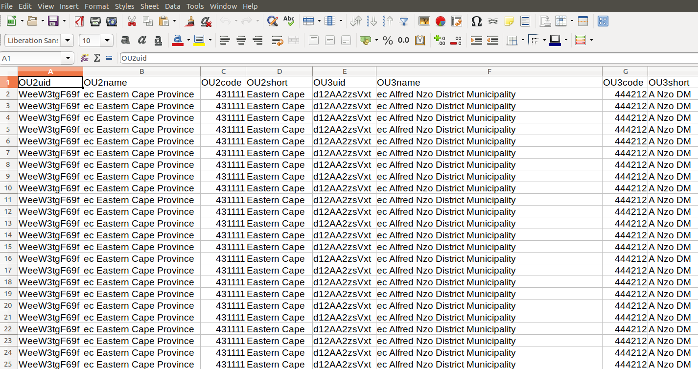
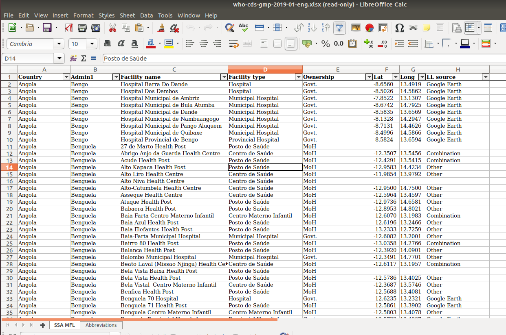

[](https://opensource.org/licenses/MIT)<br>
[](https://creativecommons.org/licenses/by/4.0/)

\*\* *Please observe individual dataset licensing if you would like to use the original datasets*


```{r setup, include=FALSE}

knitr::opts_chunk$set(echo = FALSE, message = FALSE)

## Requires dplyr 1.0.0 to use relocate()

req_packages <- c("knitr", "DT", "filesstrings", "stringdist", "lubridate", "purrr", "readxlsb", "readxl", "afrihealthsites", "forcats",  "tmap", "tmaptools")

library("tidyverse")

lapply(req_packages, library, character.only = TRUE) %>%
  invisible()

```


# Background

## `afrimapr` and `afrihealthsites`

Early in March 2020 the [_afrimapr_ team](http://afrimapr.org) started looking into mapping, comparing, and combining open health facility data sets to enable better access for decision makers in Africa during and after the COVID-19 pandemic. The [`afrihealthsites` package](http://afrimapr.org/code) currently allows one to compare two existing continental open data sets - one developed by the Kenya Medical Research Institute (KEMRI) in collaboration with the WHO, the second a global crowd sourced open health facilities mapping project - [healthsites.io](https://healthsites.io). `afrihealthsites` is under active development and we aim to get it out to potential users very early in the development cycle to allow for continuous input that can shape its functionality.

## South Africa: A case study

In South Africa the [Data Science for Social Impact](https://dsfsi.github.io/) group created an open [COVID-19 dataset and dashboard](https://arxiv.org/abs/2004.04813) to assist with local efforts. The group recruited volunteers to assist with the the collation of information about hospital resources in South Africa and I thought this was a great practical use-case for the kind of tools we had in mind to build within _afrimapr_. For more information about the challenges associated with building a comprehensive list of health facilities for South Africa see [this Github issue](https://github.com/dsfsi/covid19za/issues/115). During our conversations about developing a list of hospitals with various attributes such as address, website, contact details, services available, and corona-readiness, we realised this wasn't going to be a trivial exercise.

## Master Facility Lists

These challenges are experienced in every country when health facility lists from various stakeholders are combined to create, what is called, a Master Facility List (MFL). According to the [Master Facility List (MFL) Resource Pack](https://www.who.int/healthinfo/MFL_Resource_Package_Jan2018.pdf?ua=1) developed in 2018 by the WHO/USAID, the MFL is a complete, up-to-date, authoritative listing of the health facilities in a particular country. The article by [Maina et al (2019)](https://www.ncbi.nlm.nih.gov/pmc/articles/PMC6658526/) describes their experience in collating a MFL for Kenya and subsequently assisting other countries to develop in-house MFLs and finally the continental health facility list.

A MFL typically contains information about health facilities including:

- data to accurately identify a facility (e.g. name, unique identifier, location, contact information);
- administrative data (e.g. facility type, ownership, operational status) and
- information about the service capacity (e.g. types of services offered, number of beds).

According to the WHO, a MFL should be updated regularly (at least every two years), should be verified, and must be accessible to stakeholders. The [Master Facility List (MFL) Resource Pack](https://www.who.int/healthinfo/MFL_Resource_Package_Jan2018.pdf?ua=1) provides further guidance on the development or strengthening of a Master Facility List. 

Countries can benefit tremendously from having a high quality, up-to-date MFL in the following ways:

- it can create efficiencies by having to maintain a single list rather than maintaining several lists and continuously facing the challenge of integration;
- it facilitates information exchange across different health data systems;
- it provides metadata needed by other information systems;
- it can facilitate planning and management and
- it can support case management of patients.

A quick Google search lead to openly available MFLs for at least the following African countries:

- [Malawi](https://github.com/BaobabHealthTrust/master-facility-list)
- [Kenya](http://kmhfl.health.go.ke/#/home)
- [Namibia](https://mfl.mhss.gov.na/)
- [Nigeria](https://hfr.health.gov.ng/download/facilities)
- [Tanzania](http://hfrportal.moh.go.tz/)
- [Uganda](https://health.go.ug/sites/default/files/Signed%20n%20final%20mfl.pdf) - in PDF format


# Creating a master table which will be populated from the various datasets

The ultimate aim of this project is to work through the process of collating the best possible facility list for South Africa by combining various openly available resources. We acknowledge that this cannot be called the Master Facility List as we will only work with openly available data sets and do not have access to all information available to the Department of Health (beyond what is published in the Data Dictionary). We want to understand the process and see where [_afrimapr_](http://afrimapr.org) can aid by developing building blocks to facilitate similar processes and complimentary data analysis workflows. 

We'll create a master table that contains columns as follows:

- *country_name*: The country name. In this case it will be South Africa
- *country_iso3c*: The country [3-letter iso code](https://en.wikipedia.org/wiki/ISO_3166-1_alpha-3) 
- *admin1_name***: Province name but can be state or other administrative division level 1 for other countries
- *admin1_abb*: Abbreviation of the province/state name
- *admin2_name*: Administrative division level 2 name - in SA that is the district municipality
- *admin2_abb*: Abbreviation of the DM name
- *admin3_name*: Administrative level 3 name - in SA that is the local municipality
- *admin3_abb*: Administrative level 3 abbreviation
- *admin4_name*: Administrative level 4 name - in SA that is the ward
- *city_name*: Name of the city or town 
- *lat*: The facility's latitude coordinates
- *long*: The facility's longitude coordinates
- *type*: The type of facility (e.g. clinic, hospital, etc)
- *class*: Private or public
- *fac_name*: Name of the facility
- *fac_id*: Unique facility identifier
- *osm_id*: A unique facility identifier in Open Streetmaps
- *osm_type*: Open Streetmaps type of point 
- *date_closed*: Date when the facility was closed
- *date_opened*: Date when the facility was opened
- *contact_person*: Contact person name for the facility
- *phys_address*: The physical address of the facility
- *post_address*: Postal address of the facility
- *web*: The website URL for the facility
- *contact_phone*: The contact number for the facility
- *contact_email*: The general contact email for the facility
- *org_owner*: The organisation that is responsible for the facility (e.g. Municipality, province, private, etc.)
- *org_rural_urban*: Is this facility located in a rural or urban region
- *services*: What services are available at the facility
- *num_beds*: Number of beds if the facility is a hospital
- *numb_surgical_beds*: Number of surgical beds if the facility is a hospital
- *numb_surgeons*: Number of surgeons if the facility is a hospital
- *numb_nurses*: Number of nurses
- *open_hours*: The operating hours of the facility
- *emergency*: Yes/No if the facility have an emergency department
- *notes*: Any free text notes available about the facility
- *wheelchair*: Is it wheelchair accessible
- *electricity*: Source of electricity
- *water*: Source of water
- *dispensing*: Can medicine be dispensed
- *completeness*: How many of these columns are populated for the facility

** _Note: Please visit the entry in Wikipedia to learn more about [different administrative  divisions](https://en.wikipedia.org/wiki/List_of_administrative_divisions_by_country) in different countries._

```{r}

mfl_tb <- tibble(country_name = character() ,
                 country_iso3c = character()  ,
                 admin1_name = character(),
                 admin1_abb = character(),
                 admin2_name = character(),
                 admin2_abb = character(),
                 admin3_name = character(),
                 admin4_name = character(),
                 city_name = character(),
                 lat = numeric(),
                 long = numeric(),
                 type = character(),
                 sector = character(), 
                 fac_name = character(),
                 osm_id = numeric(),
                 osm_type = character(),
                 date_closed = ymd(),
                 date_opened = ymd(),
                 contact_person = character(),
                 phys_address = character(),
                 post_address = character(),
                 web = character(),
                 contact_phone = character(),
                 contact_email = character(),
                 org_owner = character(),
                 org_rural_urban = character(),
                 services = character(),
                 num_beds_usable = numeric(),
                 num_beds_approved = numeric(),
                 num_surgical_beds_usable = numeric(),
                 num_surgical_beds_approved = numeric(),
                 num_theatres = numeric(),
                 num_surgeons_qual = numeric(),
                 num_surgeons_unqual = numeric(),
                 num_nurses = numeric(),
                 dispensing = character(),
                 open_hours = character(),
                 emergency = character(),
                 notes = character(),
                 water = character(),
                 electricity = character(),
                 wheelchair = character(),
                 completeness = numeric())
```

# Collecting open hospital data sets from the Web

A wide variety of health facility web portals and data sets are available online. Some access points do not allow for data download, for example the Department of Health's [Primary Health Care Facilities and Services](https://www.healthestablishments.org.za/Home/Facility) page. Wikidata, the central storage for structured data of its Wikimedia sister projects, hosts a project named [Medicine/Hospitals by country/South Africa](https://www.wikidata.org/wiki/Wikidata:WikiProject_Medicine/Hospitals_by_country/South_Africa) which includes 208 facilities. Unfortunately the data for each facility is very sparsely populated.

The [District Health Barometer report data for 2017/2018](https://www.hst.org.za/publications/Pages/DHB20172018.aspx) was not considered for further analysis due to the inaccessible formatting of the tables in the spreadsheet.

[Medpages](https://www.medpages.info/sf/index.php?page=homepage), a private company, claims to be "the largest, most accurate, most up to date and most complete healthcare database available for Africa". Their data is not available for download except with express written consent (and at a fee) as they operate on a subscription basis. At the time of writing this report Medpages had contact information for 188,024 health organisations and 239,931 healthcare professionals (and counting as this is an actively managed database).

[South African Doctors](http://doctors-hospitals-medical-cape-town-south-africa.blaauwberg.net) is an online resource maintained by a private individual. The data is not available for download.

The following potentially useful sources with downloadable data were identified.

```{r Create data sources table}
sources_tbl <- tibble(Name = c("Geographical maldistribution of surgical resources in South Africa: A review of the number of hospitals, hospital beds and surgical beds", 
                               "District Health Barometer info 2016 2017 06 Feb 2018",
                               "District Health Barometer 2018/2019",
                               "National Department of Health Data Dictionary ",
                               "Healthsites.io",
                               "KEMRI/WHO: A spatial database of health facilities managed by the public health sector in sub-Saharan Africa"),
  `Short Name` = c("Hospital Bed",
                   "DoH DHB 2016/2017",
                   "HST DHB 2018/2019",
                   "DoH Data Dictionary",
                   "Healthsites",
                   "KEMRI/WHO"),
  Information = c("Facility names, Number of beds and surgeons", 
                  "Facility names, type", 
                  "Facility names, type, date opened, coords, date closed",
                  "Facility names, addresses, coordinate, type, rural/urban, ownership(e.g. national/provincial/private)",
                  "Facility names, type, coordinates, and others depending on crowdsourced data contributed",
                  "Facility names, type, ownership, coordinates, source"),
  `Admin Level` = c("District Municipality (3)", 
                    "District Municipality (3)", 
                    "District Municipality (3)",
                    "Local Municipality (4)",
                    "Country (1)",
                    "Province (2)"),
  Web = c("[Article](http://www.samj.org.za/index.php/samj/article/view/12143)",
          "[Report](http://www.health.gov.za/index.php/2014-03-17-09-09-38/reports/category/424-reports-2017#)",
          "[Report](https://www.hst.org.za/publications/Pages/DISTRICT-HEALTH-BAROMETER-201819.aspx)",
          "[Data Repository](https://dd.dhmis.org/orgunits.html?file=NIDS%20Integrated&source=nids&ver=91b9)",
          "[Homepage](https://healthsites.io/)",
          "[Article](https://dx.doi.org/10.1038%2Fs41597-019-0142-2)"),
  `Raw Data` = c("[Figshare](https://figshare.com/articles/SURGICAL_RESOURCES_latestmarch2016_xlsx/12066711)",
           "[Spreadsheet](http://www.health.gov.za/index.php/2014-03-17-09-09-38/reports/category/424-reports-2017?download=2652:district-health-barometer-info-2016-2017-06-feb-2018\ )", 
           "[Spreadsheet](https://www.hst.org.za/publications/District%20Health%20Barometers/DHB2019_19Feb2020.xlsb)",
           "[No direct link available - select Download on page and select 'Level 5' data](https://dd.dhmis.org/orgunits.html?file=NIDS%20Integrated&source=nids&ver=91b9)",
           "[API access](https://github.com/healthsites/healthsites/wiki/API) or [shapefile](https://healthsites.io/map?country=South Africa [Download directly in R via afrihealthsites package](https://afrimapr.github.io/afrimapr.website/code/) that forms part of [afrimapr](http://afrimapr.org))",
           "[Spreadsheet](https://figshare.com/articles/Public_health_facilities_in_sub_Saharan_Africa/7725374) or [Download directly in R via afrihealthsites package](https://afrimapr.github.io/afrimapr.website/code/) that forms part of [afrimapr](http://afrimapr.org)"),
  `Data License` = c("CC-BY-4.0", 
                     "No explicit license", 
                     "No explicit license",
                     "No explicit license",
                     "CC-BY-4.0",
                     "CC-0"),
  `Origin/Owner` = c("Dr. Angela Dell", 
                     "South African National Department tof Health", 
                     "Health Systems Trust",
                     "South African National Department of Health",
                     "Healthsites.io/Crowdsourcing",
                     "Hosted by WHO Global Malaria Program/Collected by KEMRI"),
  `Last Updated` = c("Mar 2016", 
                     "Feb 2018",
                     "Feb 2020",
                     "Aug 2019",
                     "Mar 2020",
                     "Feb 2019")
)

```

```{r Print data sources table}

colmns = dim(sources_tbl)[2]

sources_tbl %>%  kableExtra::kable() %>% 
  kableExtra::kable_styling(bootstrap_options = c("striped", "hover"), full_width = F) %>% 
  kableExtra::column_spec(1:colmns, border_right = T, border_left = T) %>% 
  kableExtra::scroll_box(width = "100%", height = "700px") 

remove(sources_tbl)

```


# Data cleaning

Most data sets required cleaning up to be able to work with in a programmatic way. 

## Hospital Bed Data

### Raw data format

The data was made available in an Excel spreadsheet format with separate sheets for every province's private and public health facilities.



### Raw data to tidy data

The _readme_ file displayed below shows the steps taken to convert the raw Hospital Bed data set to tidy data. The data was not extracted programmatically due to the variable format of the tables in each sheet.

```{r comment=''}

cat(readLines("readme/readme_za_hospital_resources.txt"), sep = '\n')

```

### Tidy data

```{r}

# Load hospital resources data from Angela Dell's research
hosp_bed_tb <- read_csv('data/tmp_data/za_hospital_resources.csv') 

hosp_bed_tb <- hosp_bed_tb %>% 
  mutate(province = case_when(province == "KZN" ~ "KZ",
                              TRUE ~ as.character(province))) %>% 
  rename(admin1_abb = province,
         admin2_name = region,
         type = hosp_class,
         fac_name = hosp_name,
         sector = hosp_type,
         num_beds_approved = beds_approved,
         num_beds_usable = beds_usable,
         num_surgical_beds_approved = beds_surgical_approved,
         num_surgical_beds_usable = beds_surgical_usable,
         num_surgeons_qual = surgeons_qualified,
         num_surgeons_unqual = surgeons_unqualified,
         num_theatres = theatres,
         contact_phone = hosp_contact
         ) %>% 
  mutate(admin1_name = case_when(admin1_abb == 'EC' ~'Eastern Cape',
                              admin1_abb == 'FS' ~'Free State',
                              admin1_abb == 'GP' ~ 'Gauteng',
                              admin1_abb == 'KZ' ~ 'KwaZulu Natal',
                              admin1_abb == 'LP' ~ 'Limpopo',
                              admin1_abb == 'MP' ~ 'Mpumulanga',
                              admin1_abb == 'NC' ~ 'Northern Cape',
                              admin1_abb == 'NW' ~ 'North West',
                              admin1_abb == 'WC' ~ 'Western Cape')) %>% 
  mutate(admin2_name = str_replace(admin2_name, " [DM]M", "")) %>% 
  mutate(contact_phone = as.character(contact_phone)) %>% 
  select(- c(last_update_day, last_updated_month, last_updated_year, source, source_email, source_name, source_phone, source_surname))


hosp_bed_tb %>%  head(.) %>% kableExtra::kable() %>% 
  kableExtra::kable_styling(bootstrap_options = c("striped", "hover", "bordered"), full_width = F) %>% 
  kableExtra::scroll_box(width = "100%")

```

## DoH District Health Barometer Data 2016/2017

### Raw data format

The data was made available in Excel spreadsheet format with separate sheets for a variety of definitions, measurements, and summaries. The health facility list was stored in a sheet called 'Hospitals'. District codes is available in this sheet, but we need to get the full district (or municipality) name from a sheet called 'Seq'.





### Raw data to tidy data

The _readme_ file displayed below shows the steps taken to convert the raw DoH Health Barometer hospital data set to tidy data. The data was not extracted programmatically due to the variable format of the tables in each sheet. Once data was in CSV format it was further cleaned up in [Openrefine](http://openrefine.org) with [this JSON script](https://github.com/anelda/za_open_hospital_data/blob/master/scripts/za_hospital_temp_to_refine.json). The CSV was then exported from Openrefine and imported into R for subsequent cleaning and analysis. The full steps for data cleaning are described below. The R code is available in [this file](https://github.com/anelda/za_open_hospital_data/blob/master/za_hospital_analysis_starter.Rmd). 

```{r comment=''}

cat(readLines("readme/readme_za_hospital_list.txt"), sep = '\n')

```

To clean the district names sheet for use in a join with the hospitals data the following steps were followed:

```{r comment=''}

cat(readLines("readme/readme_za_hospital_district_names.txt"), sep = '\n')

```

To join the hospital data with the district names data, a short R script was written and is included in [this file](https://github.com/anelda/za_open_hospital_data/blob/master/za_hospital_analysis_starter.Rmd).

```{r}

# Load cleaned-up hospital list from and district data data from DoH District Health Barometer file

# Load hospital list file from OpenRefine (see readme_za_hospital_list.txt) 
hospital_list <- read_csv('data/tmp_data/za_hospital_list_refine.csv')

# Load district names/codes file (see readme_za_hospital_district_names.txt)
admin2_names <- read_csv('data/tmp_data/za_hospital_district_names.csv')

# Merge data

# Add column to table showing full name of district
dhb_2016_tb <- hospital_list %>% 
  # This way we'll ensure that the province column doesn't occur twice in the final dataset
  merge(admin2_names, by = c('province', 'district_mdb')) %>% 
  # Move the newly added district_names column to just after the district_mdb column 
  relocate('district_name', .after = district_mdb) %>% 
  rename(admin1_abb = province,
         admin2_abb = district_mdb,
         admin2_name = district_name,
         type = org_unit_type,
         fac_name = facility_name
         ) %>% 
  mutate(admin1_abb = case_when(admin1_abb == "KZN" ~ "KZ",
                              TRUE ~ as.character(admin1_abb))) %>% 
  mutate(admin1_name = case_when(admin1_abb == 'EC' ~'Eastern Cape',
                                 admin1_abb == 'FS' ~'Free State',
                                 admin1_abb == 'GP' ~ 'Gauteng',
                                 admin1_abb == 'KZ' ~ 'KwaZulu Natal',
                                 admin1_abb == 'LP' ~ 'Limpopo',
                                 admin1_abb == 'MP' ~ 'Mpumulanga',
                                 admin1_abb == 'NC' ~ 'Northern Cape',
                                 admin1_abb == 'NW' ~ 'North West',
                                 admin1_abb == 'WC' ~ 'Western Cape')) %>% 
  select(- c(copyright, source_name, source, date_updated_year, date_updated_month, date_updated_day))

remove(hospital_list, admin2_names)

```


### Tidy data

```{r}

# Load hospital list data from DoH District Health Barometer file

dhb_2016_tb %>%  head(.) %>% kableExtra::kable() %>% 
  kableExtra::kable_styling(bootstrap_options = c("striped", "hover", "bordered"), full_width = F) %>% 
  kableExtra::scroll_box(width = "100%", height = "200px")

```


## HST District Health Barometer Data 2018/2019

### Raw data format

The data was made available in  Excel Binary Workbook format (.xlsb)  with separate sheets for a variety of definitions, measurements, and summaries. Health facility information was available from a sheet called 'Fac_list'.



### Tidy data

Data cleaning was performed in R (the code is included in [this document](https://github.com/anelda/za_open_hospital_data/blob/master/za_hospital_analysis_starter.Rmd)).

```{r}

dhb_2018_tb <- read_xlsb('data/raw_data/DHB2019_19Feb2020.xlsb', sheet = 'Fac_list')

dhb_2018_tb <- dhb_2018_tb %>% 
  # Add province long name to make comparable with other datasets
  mutate(admin1_name = case_when(Prov == 'EC' ~'Eastern Cape',
                              Prov == 'FS' ~'Free State',
                              Prov == 'GP' ~ 'Gauteng',
                              Prov == 'KZ' ~ 'KwaZulu Natal',
                              Prov == 'LP' ~ 'Limpopo',
                              Prov == 'MP' ~ 'Mpumulanga',
                              Prov == 'NC' ~ 'Northern Cape',
                              Prov == 'NW' ~ 'North West',
                              Prov == 'WC' ~ 'Western Cape')) %>%
  # In the raw data 9999-12-31 is used as placeholder for facility closing dates that is not closed yet.
  # Lubridate can't use 9999 as valid year so can't convert this into a date format
  # Replace 9999-12-31 with NA
  mutate(Date_Closed = case_when(Date_Closed == "9999-12-31" ~ NA_character_,
                                 TRUE ~ as.character(Date_Closed))) %>% 
  # Clean up columns we'll use in analysis later on
  # Remove leading province abbreviation and space and convert date columns to date
  mutate(OrgUnit5 = str_replace(OrgUnit5, ('^\\w\\w\\s'), ''),
         Date_open = ymd(Date_open),
         Date_Closed = ymd(Date_Closed)) %>% 
  # Rename columns to be more friendly for coding
  rename(fac_name = OrgUnit5,
         type = OrgUnitType,  
         admin1_abb = Prov,
         admin2_abb = dm2016,
         date_opened = Date_open,
         date_closed = Date_Closed,
         admin3_abb = lm2016_sd,
         comment = OrgUnitComment,
         lat = Latitude,
         long = Longitude,
         notes = OrgUnitComment
  ) %>% 
  select(-c(OrgLevel, OU5UID, OrgUnit5_ID))

```


```{r}

dhb_2018_tb %>%  head(.) %>% kableExtra::kable() %>% 
  kableExtra::kable_styling(bootstrap_options = c("striped", "hover", "bordered"), full_width = F) %>% 
  kableExtra::scroll_box(width = "100%", height = "200px")


```

## DoH Data Dictionary

### Raw data format

The data was made available in CSV format.




### Tidy data

Data cleaning was performed in R (the code is included in [this document](https://github.com/anelda/za_open_hospital_data/blob/master/za_hospital_analysis_starter.Rmd).


```{r}
doh_dd_tb <- read_csv('data/raw_data/za_ou5_doh.csv')

doh_dd_tb <- doh_dd_tb %>% 
  # Drop unused columns
  select(-c(OU2uid, OU2name, OU2code, OU3uid, OU3name, OU3code, OU4uid, OU4code,
            OU4name, OU5short, OU5code, lastupdated, `STI Sentinel`, coordinates, contactperson)) %>% 
  # Add abbreviations for provinces to be able to comparet o other datasets
  mutate(admin1_abb = case_when(OU2short == 'Eastern Cape' ~ 'EC',
                                OU2short == 'Free State' ~ 'FS',
                                OU2short == 'Gauteng' ~ 'GP',
                                OU2short == 'KwaZulu-Natal' ~ 'KZ',
                                OU2short == 'Limpopo' ~ 'LP',
                                OU2short == 'Mpumalanga' ~ 'MP',
                                OU2short == 'Northern Cape' ~ 'NC',
                                OU2short == 'North West' ~ 'NW',
                                OU2short == 'Western Cape' ~ 'WC')) %>%
  # Clean up columns we'll use in analysis later on
  # Remove leading province abbreviation and space
  mutate(OU5name = str_replace(OU5name, ("^\\w\\w\\s"), ''),
         OU3short = str_replace(OU3short, ("\\s[DM]M"), ''),
         OU4short = str_replace(OU4short, ("\\s[DL]M"), '')
  ) %>% 
    rename(admin1_name = OU2short,
           admin2_name = OU3short,
           admin3_name = OU4short,
           fac_name = OU5name,
           date_opened = openingdate,
           fac_id = OU5uid,
           phys_address = address,
           date_closed = closeddate,
           long = longitude,
           lat = latitude,
           org_owner = OrgUnitOwnership,
           org_rural_urban = OrgUnitRuralUrban,
           type = OrgUnitType
    ) %>% 
  mutate(date_opened = ymd(date_opened),
         date_closed = ymd(date_closed))

```

```{r}

doh_dd_tb %>%  head(.) %>% kableExtra::kable() %>% 
  kableExtra::kable_styling(bootstrap_options = c("striped", "hover", "bordered"), full_width = F) %>% 
  kableExtra::scroll_box(width = "100%", height = "200px")

```

## Healthsites.io

### Raw data format

The data was imported into R as a shapefile via the [`afrihealthsites` package](https://github.com/afrimapr/afrihealthsites) from [_afrimapr_](http://afrimapr.org).

### Tidy data

Data cleaning was performed in R (the code is included in [this document](https://github.com/anelda/za_open_hospital_data/blob/master/za_hospital_analysis_starter.Rmd)).

```{r}

# Import data as feature table (class = dataframe)
healthsites_sf <- spbabel::feature_table(afrihealthsites("south africa", datasource = "healthsites", plot = FALSE))

# Convert coordinate point to matrix
coords_tb = as_tibble(st_coordinates(healthsites_sf$geometry))

healthsites_tb <-  as_tibble(healthsites_sf) %>% 
  # Remove this column as it will cause trouble when we introduce the type column later
  select(-c(type, completeness, is_in_health_zone, changeset_id, insurance, 
            uuid, operational_status, source, is_in_health_area, changeset_version, 
            changeset_timestamp, changeset_user, healthcare, geometry, addr_full, speciality)) %>% 
  # Add coordinate columns to tibble
  bind_cols(coords_tb) %>% 
  # Numeric columns read in as character vector for some strange reason
  mutate(beds = as.numeric(beds),
         staff_doctors = as.numeric(staff_doctors),
         staff_nurses = as.numeric(staff_nurses)) %>% 
  # st_coordinates by default create an X and Y column for Lat, Long
  rename(lat = X,
         long = Y,
         type = amenity,
         services = health_amenity_type,
         num_surgeons_qual = staff_doctors,
         contact_phone = contact_number,
         open_hours = opening_hours,
         fac_name = name,
         num_nurses = staff_nurses,
         water = water_source,
         num_beds_usable = beds,
         web = url,
         sector = operator_type,
         country_name = country,
         country_iso3c = iso3c,
         org_owner = operator
         )


remove(healthsites_sf, coords_tb)

```

```{r}

head(healthsites_tb) %>% kableExtra::kable() %>% 
  kableExtra::kable_styling(bootstrap_options = c("striped", "hover", "bordered"), full_width = F) %>% 
  kableExtra::scroll_box(width = "100%", height = "200px")

```

### Addresses in healthsites.io

Very few of the health facilities have more information about where it is located i.e. province, district municipality, street address as can be seen in the table above. We therefore used reverse geocoding to go from coordinates (which was available in healthsites.io data) to addresses.

Using the `tmaptools` package in R to reverse geocode the coordinates, we were able to access a rich treasure trove of information including up to admin level 4 data, facility name, physical address, and more. Running the code took about 12 hours as we have to respect the fair usage policy of OSM. The R code is available in [this file](https://github.com/anelda/za_open_hospital_data/blob/master/za_hospital_analysis_starter.Rmd).

```{r warning=FALSE}

# Create empty dataframe to capture addresses
# entry_revcode <- data.frame()

# Run through healthsites_tb one entry at a time to allow system pause between making
# calls to open street maps as per their fair usage policy

# for (row in 1:nrow(healthsites_tb)) {
#   
#   print(paste("Row number: ", row))
#   
#   latitude <- healthsites_tb[row, "lat"]
#   longitude <- healthsites_tb[row, "long"]
#   
#   temp_df <- rev_geocode_OSM(latitude, longitude, as.data.frame = TRUE)
#   
#   entry_revcode <- entry_revcode %>% 
#     bind_rows(temp_df)
#   
#   # Not allowed to make more than 1 call per second, so we'll make 1 call per 10 seconds
#   print('Sleeping for 10 seconds')
#   Sys.sleep(10)
#   
# }

# Let's save this data for later use as we don't want to have to download it again from OSM
# write_csv(entry_revcode, "data/tmp_data/healthsites_revgeocoding.csv")
# Read the data in from CSV rather than running the geocoding again
entry_revcode <- read_csv("data/tmp_data/healthsites_revgeocoding.csv")
  
# Clean up healthsites reverse coded information to merge with the original dataset
entry_revcode <- entry_revcode %>% 
  mutate(phys_address = paste(house_number, road, town, postcode, sep = ", ")) %>% 
  rename(fac_name_osm = ref,
         admin1_name = state,
         admin2_name = county,
         admin3_name = city,
         admin4_name = suburb) %>% 
  # Add abbreviations for provinces to be able to comparet o other datasets
  mutate(admin1_abb = case_when(admin1_name == 'Eastern Cape' ~ 'EC',
                                admin1_name == 'Free State' ~ 'FS',
                                admin1_name == 'Gauteng' ~ 'GP',
                                admin1_name == 'KwaZulu-Natal' ~ 'KZ',
                                admin1_name == 'Limpopo' ~ 'LP',
                                admin1_name == 'Mpumalanga' ~ 'MP',
                                admin1_name == 'Northern Cape' ~ 'NC',
                                admin1_name == 'North West' ~ 'NW',
                                admin1_name == 'Western Cape' ~ 'WC')) %>%
  mutate(admin3_name = case_when(str_detect(admin3_name, 
                                            "Local Municipality") ~ str_remove(admin3_name, 
                                                                               " Local Municipality"),
                                 TRUE ~ as.character(admin3_name)),
         admin2_name = case_when(str_detect(admin2_name,
                                            "District Municipality") ~ str_remove(admin2_name,
                                                                                 " District Municipality"),
                                 str_detect(admin2_name, 
                                            "Metropolitan Municipality") ~ str_remove(admin2_name, 
                                                                                     " Metropolitan Municipality"),
                                 TRUE ~ as.character(admin2_name))) %>% 
  select(phys_address, admin1_name, admin1_abb, admin2_name, admin3_name, admin4_name) 

# Combine original healthsites data with OSM data
healthsites_augmented_tb <- healthsites_tb %>% 
  bind_cols(entry_revcode)

# Clean up the workspace
remove(entry_revcode, healthsites_tb)

```

```{r}

head(healthsites_augmented_tb) %>% kableExtra::kable() %>% 
  kableExtra::kable_styling(bootstrap_options = c("striped", "hover", "bordered"), full_width = F) %>% 
  kableExtra::scroll_box(width = "100%", height = "200px")


```
## KEMRI/WHO

### Raw data

The data for the whole of sub-Saharan Africa was made available in an Excel spreadsheet. Health facility data is available from the sheet named 'SSA MFL'. The data is also available from the [`afrihealthsites` package](http://afrimapr.org/code) that forms part of  _[afrimapr](http://afrimapr.org)_. `afrihealthsites` offer two options for importing the data:

- sf format (Note that not all facilities listed in the raw data set have coordinates associated with them. Facilities without coordinates will not be available in the sf data object) and
- dataframe format (Including all facilities listed in the raw data file including those without coordinates).



### Tidy data

Data cleaning was performed in R (the code is included in [this document](https://github.com/anelda/za_open_hospital_data/blob/master/za_hospital_analysis_starter.Rmd)).

```{r}

# Load KEMRI/WHO data via afrimapr::afrihealthsites
# Import only South African data

kemri_who_tb <- afrihealthsites("south africa", datasource = "who", plot = FALSE, returnclass = "dataframe")

kemri_who_tb <- kemri_who_tb %>% 
  rename(country_name = Country,
         admin1_name = Admin1,
         fac_name = `Facility name`,
         type = `Facility type`,
         org_owner = Ownership,
         lat = Lat,
         long = Long,
         country_iso3c = iso3c
         ) %>% 
  mutate(admin1_abb = case_when(admin1_name == 'Eastern Cape' ~ 'EC',
                              admin1_name == 'Free State' ~ 'FS',
                              admin1_name == 'Gauteng' ~ 'GP',
                              admin1_name == 'KwaZulu-Natal' ~ 'KZ',
                              admin1_name == 'Limpopo' ~ 'LP',
                              admin1_name == 'Mpumalanga' ~ 'MP',
                              admin1_name == 'Northern Cape' ~ 'NC',
                              admin1_name == 'North West' ~ 'NW',
                              admin1_name == 'Western Cape' ~ 'WC')
    ) %>% 
  select(-`LL source`)
  
```

```{r}

kemri_who_tb %>%  head(.) %>% kableExtra::kable() %>% 
  kableExtra::kable_styling(bootstrap_options = c("striped", "hover", "bordered"), full_width = F) %>% 
  kableExtra::scroll_box(width = "100%", height = "200px")

```

# What do we have?


```{r}

# Combine all the dataframes into one for analysis

mfl_tb_all <- mfl_tb %>% 
  # Capture which dataframe each row came from
  bind_rows(list(hosp_bed_tb, 
            dhb_2016_tb, 
            dhb_2018_tb, 
            doh_dd_tb, 
            kemri_who_tb, 
            healthsites_augmented_tb), .id = "id" ) %>% 
  # Rename the dataset IDs to something sensible
  mutate(id = case_when(id == "2" ~ "Hospital Bed",
                        id == "3" ~ "DHB 2016",
                        id == "4" ~ "DHB 2018",
                        id == "5" ~ "DOH DD",
                        id == "6" ~ "KEMRI/WHO",
                        id == "7" ~ "Healthsites.io")) %>% 
  # Rename the id column to dataset to avoid confusion with facility id
  rename(dataset = id)

# Clean up values in each column to make data comparable

mfl_tb_all_clean <- mfl_tb_all %>% 
  # First add country name and code for each as we know it's implicit but not necessarily explicitly added to the raw data
  mutate(country_name = case_when(is.na(country_name) ~ "South Africa",
                                  TRUE ~ as.character(country_name)),
         country_iso3c = case_when(is.na(country_iso3c) ~ "ZAF",
                                   TRUE ~ as.character(country_iso3c))) %>% 
  # Some facilities do not have names (healthsites.io)
  mutate(fac_name = case_when(fac_name == "" ~ NA_character_,
                              TRUE ~ as.character(fac_name))) %>% 
  # Count number of variables that is not missing in each row and calculate percentage completeness for each row (46 columns)
  mutate(completeness = as.numeric(apply(., MARGIN = 1, function(x) sum(!is.na(x))/dim(mfl_tb_all)[2]*100))) %>% 
  mutate(type = str_to_lower(type)) %>%
  mutate(type = str_replace(type, ("^wc "), ''))

# Add column with higher level type of facility deducted from type column via visual inspection of values
mfl_tb_all_clean <- mfl_tb_all_clean %>%   
  mutate(super_type = case_when(str_detect(type, "clinic") ~ "clinic",
                                type == "clinix" ~ "hospital",
                                type == "community day centre" ~ "community health centre",
                                str_detect(type, "community health centre") ~ "community health centre",
                                str_detect(type, "hospital") ~ "hospital",
                                str_detect(type, "doctor") ~ "doctor",
                                str_detect(type, "environmental health service") ~ "ehs",
                                str_detect(type, "ehs") ~ "ehs",
                                str_detect(type, "forensic") ~ "forensic",
                                type == "frail care" ~ "frail care/hospice",
                                type == "general practitioner" ~ "doctor",
                                type == "health district office" ~ "health office",
                                type == "health sub-district office" ~ "health office",
                                type == "home based care" ~ "frail care/hospice",
                                type == "hospice" ~ "frail care/hospice",
                                # This isn't strictly true - all independent seem to be private but some are clinics
                                # Will have to be evaluated manually!
                                type == "independent" ~ "hospital",
                                type == "lenmed" ~ "hospital",
                                type == "life" ~ "hospital",
                                type == "longterm care" ~ "frail care/hospice",
                                type == "mediclinic" ~ "hospital",
                                type == "mediclnic" ~ "hospital",
                                type == "melomed" ~ "hospital",
                                type == "medical centre" ~ "hospital",
                                type == "mental health centre" ~ "mental health care",
                                type == "midwife obstetrics unit" ~ "midwife",
                                type == "mining" ~ "hospital",
                                type == "mobile service" ~ "mobile service",
                                type == "netcare" ~ "hospital",
                                type == "nurse practitioner" ~ "nurse",
                                type == "occupational health centre" ~ "occupational health centre",
                                type == "province" ~ "pharmaceutical/pharmacy",
                                str_detect(type, "oral") ~ "oral health care",
                                str_detect(type, "pharma") ~ "pharmaceutical/pharmacy",
                                type == "primary condom distribution site" ~ "condom distribution site",
                                str_detect(type, "ems station") ~ "ems station",
                                ## Must be edited manually as it's a mix of hospitals, clinics etc
                                type == "private ward" ~ "hospital",
                                type == "psychiatry home" ~ "mental health care",
                                str_detect(type, "reproductive") ~ "reproductive service",
                                str_detect(type, "school") ~ "school health service",
                                type == "surgical centre" ~ "hospital",
                                type == "ward" ~ "hospital",
                                type == '' ~ NA_character_,
                                TRUE ~ as.character(type)
                                )
  )

# Export tibble as CSV for further cleaning in OpenRefine as described below

write_csv(mfl_tb_all_clean, "data/tmp_data/mfl_tb_all_clean.csv")

remove(dhb_2016_tb, dhb_2018_tb, doh_dd_tb, healthsites_augmented_tb, hosp_bed_tb, kemri_who_tb, mfl_tb_all, mfl_tb_all_clean)

```

## Further text cleaning in OpenRefine

There is a lot of weird things in the names of places, including municipality names, facility names, etc. OpenRefine is a great tool to look into what's going on with names - especially if you want to manually inspect things before "fixing" them, rather than applying brute force operations on all elements in a column. We did some further cleaning up of the data set using this [JSON script](https://github.com/anelda/za_open_hospital_data/blob/master/scripts/tidy_mfl.json) in OpenRefine 3.2.

## Some statistics about the datasets

```{r}
## Summary statistics on full dataframe ----

# Read in cleaner data from OpenRefine
# Have to specify each column type as read_csv guess type from first 1000 which leads to logical type if first 1000 is NA
mfl_refined <- read_csv("data/tidy_data/mfl_refine.csv", col_names = TRUE,
                        cols(dataset = col_character(),
                             country_name = col_character(), 
                             country_iso3c = col_character(),
                             admin1_name = col_character(),
                             admin1_abb = col_character(),
                             admin2_name = col_character(),
                             admin2_abb = col_character(),
                             admin3_name = col_character(),
                             admin4_name = col_character(),
                             city_name = col_character(),
                             lat = col_double(),
                             long = col_double(),
                             type = col_character(),
                             sector = col_character(),
                             fac_name = col_character(),
                             osm_id = col_character(),
                             osm_type = col_character(),
                             date_closed = col_date(),
                             date_opened = col_date(),
                             contact_person = col_character(),
                             phys_address = col_character(),
                             post_address = col_character(),
                             web = col_character(),
                             contact_phone = col_character(),
                             contact_email = col_character(),
                             org_owner = col_character(),
                             org_rural_urban = col_character(),
                             services = col_character(),
                             num_beds_usable = col_integer(),
                             num_beds_approved = col_integer(),
                             num_surgical_beds_usable = col_integer(),
                             num_surgical_beds_approved = col_integer(),
                             num_theatres = col_integer(),
                             num_surgeons_qual = col_integer(),
                             num_surgeons_unqual = col_integer(),
                             num_nurses = col_integer(),
                             dispensing = col_character(),
                             open_hours = col_character(),
                             emergency = col_character(),
                             notes = col_character(),
                             water = col_character(),
                             electricity = col_character(),
                             wheelchair = col_character(),
                             completeness = col_double(),
                             admin3_abb = col_character(),
                             fac_id = col_character(),
                             super_type = col_character()
                             )
)

```

```{r}
# How many facilities for each dataset

count_facilities <- mfl_refined %>% group_by(dataset) %>% 
  tally(name = "facilities") %>%
  mutate(dataset = fct_reorder(dataset, -facilities))

count_facilities %>% 
  ggplot(aes(x = dataset, y = facilities)) +
  geom_bar(stat = "identity", fill = "#53868b", width = 0.6) +
  theme_minimal() +
  labs(y = "Number of facilities listed", x = "Dataset") +
  ggtitle("Number of facilities listed in each dataset")

remove(count_facilities)
```

```{r fig.height = 10, fig.width=10}
# How many high level types of facilities per dataset

mfl_refined %>% 
  group_by(dataset, super_type) %>% 
  # Count number of super_types per datase
  tally() %>% 
  filter(n > 10) %>% 
  ggplot(aes(x = super_type, y = n, fill = super_type)) +
  geom_bar(stat = "identity", position = "stack") +
  theme_minimal() +
  theme(legend.position ="bottom") +
  labs(y = "Number of occurrences of facility type", x = "", fill = "Facility type") +
  ggtitle("Most frequently occurring facility types in each dataset (n > 10)") +
  coord_flip() +
  facet_wrap(~ dataset) +
  theme(legend.position = "none")
  

```

## Looking at completeness of the datasets

We counted the number of columns that are not empty (NA) and divided that total by the total number of columns(46) to calculate the percentage completeness per observation for each data set.

The table below shows the mean completeness for all the data sets. The most complete data set is healthsites.io, but we must point out that many of the master table columns were taken directly from the original healthsites.io column list and we have added information about various admin levels via reverse geocoding. It is clear that there is a *lot* of outstanding information in all datasets. 

In the next step we'll see if it is possible to add data from the various data sets together to get a more complete single entry for each health facility listed in the complete data set.

```{r}

# How complete is each dataset?
# As measured by the percentage of columns with values (as opposed to NA) - see mfl_tb_all_clean$completeness

completeness_tb <- mfl_refined %>% 
  group_by(dataset) %>% 
  summarise("Average completeness (%)" = round(mean(completeness)))


completeness_tb %>%  kableExtra::kable() %>% 
  kableExtra::kable_styling(bootstrap_options = c("striped", "hover"), full_width = F) 

remove(completeness_tb)

```

## Combining information from different datasets

As we stated earlier on in the document, the ultimate goal of this project is to work through the process of collating the best possible facility list for South Africa by combining various openly available resources. We're aiming to have a single entry for each facility from the total data set, with as much columns filled as possible.

It appears as if some of the data sets contain duplicates that differ only very slightly (almost indiscriminable). One example is _Ben-Chem Pharmacy_ vs _Ben-Chem Dispensary Pharmacy_ that also has slightly different coordinates in the two entries in a single data set. Another is the occurrence of _Clicks Mahikeng Pharmacy_ vs _Clicks Mahikeng Mall Pharmacy_ vs _Clicks Mahikeng Crossing Pharmacy_ listed as three facilities in the DoH Data Dictionary even when two of these listings have exactly the same coordinates.  

When we analyse facility names, it is important to note that some of the bigger chains (Dis-Chem, Clicks) may have several branches in a single city. At the same time some seemingly unique names may appear in more than one province. We can't group by facility names only in trying to find the number of unique facilities in a data set.

Other factors that increases the difficulty of combining the data sets include:

- typos;
- varying capitalisation;
- different types of spelling (e.g. _KwaZulu Natal_ vs _Kwa-Zulu Natal_);
- adding or dropping location information to facility names (when the location info isn't officially part of the facility name e.g. _Clicks Mahikeng Pharmacy_ which may be identified in one dataset as _Clicks_ with location information specified in other columns);
- a single location being divided up into subsections (e.g. correctional health facility being divided up into maximum, medium or only showing correctional in different data sets);
- incorrect coordinates assigned to places may lead to incorrect reverse geocoding and interpretation of the different admin levels (e.g. _Bokomoso Pharmacy_ vs _Bokamoso Health Pharmacy_ is indicated to be in two different provinces, but Bokamoso is a specific area occurring only in one of the two provinces so clearly incorrectly geocoded in one of the data sets);
- incomplete names (e.g. _Boland (Touws River) Home Based Care_ vs _Boland Hospice (Touws River) Home Based Care_);
- differences in naming conventions between data sets (e.g. _Booth Memorial Step Down Facility_ vs _Booth Memorial Intermediate Care_ and _Dora Nginza Dental Service_ vs _Dora Nginza Oral Health Service_);
- name changes (e.g. _Sunshine Hospital_ used to be _Actonville Hospital_ also possibly _Gatesvill Medical Centre Private Hospital_ as _Melomed Gatesville Hospital_);
- single facility occurring in the Healthsites data set with osm_type as both _way_ and _node_;
- facilities may be listed as closed but may have undergone a name change or location change (e.g. _Cango Clinic Private Hospital_);
- not using full name of facility (e.g. _Albert Luthuli Local Municipality - LG EHS_ vs _Chief Albert Luthuli Local Municipality - LG EHS_);
- incorrect entries (e.g. _Clicks Westgate Pharmacy Swartland_ from DoH DD data set);
- generic names (e.g. _clinic_ or _dental practice_);
- including translations in names (e.g. _Delmas Apteek Pharmacy_ or having the name in non-English e.g. _Fouries Apteek_ vs _Fouries Pharmacy_) and
- many more!

Clearly we should not be relying on the facility name, neither the coordinates to automatically combine information about locations that may appear to be the same place. And because of the variability in terms of completeness of the data, neither should we be grouping on too many administrative levels. The table below shows the frequency for a facility name within an area (up to admin level 4). More than 90% of the facilities are only observed once across the six data sets when we narrow the filter down to admin level 4. Visual inspection of the data set clearly shows a large number of "unique" observations are in fact duplicates across data sets and could be merged in a subsequent step.

```{r}

singularity_level4 <- mfl_refined %>% 
  # Try to see how many times each facility name appears in the dataset without cleaning things up
  # Facility names are also grouped by admin levels as sometimes the same name appears in different regions
  group_by(fac_name, admin1_abb, admin2_name, admin3_name, admin4_name) %>% 
  tally(name = "num_fac", sort = TRUE) %>% 
  ungroup() %>%
  select(num_fac) %>%
  group_by(num_fac) %>%
  tally() %>%
  mutate(Count = case_when(num_fac ==1 ~ "1",
                                              num_fac > 1 & num_fac <= 5 ~ "2 - 5",
                                              num_fac > 5 & num_fac <= 100 ~ "6 - 10")) %>% 
  ungroup() %>% 
  group_by(Count) %>% 
  summarise(sum(n)) %>%
  rename(total = "sum(n)") %>% 
  mutate("Percentage of total data set" = round(total/dim(mfl_refined)[1]*100, 2)) %>% 
  rename("Number of observations across all datasets" = Count,
         "Count" = total)

singularity_level4 %>%  kableExtra::kable() %>% 
  kableExtra::kable_styling(bootstrap_options = c("striped", "hover"), full_width = F) 

```

When we only group the data based on facility name and admin level 1 the picture changes somewhat. The table below shows that a number of facilities are listed in the data sets without names. The more generic names (larger chain groups for example) are listed many times across several data sets and can only be separated into unique entries for merging if we also look at lower administrative level and descriptive data.

```{r}

singularity_level1 <- mfl_refined %>% 
  # Try to see how many times each facility name appears in the dataset without cleaning things up
  # Facility names are also grouped by admin levels as sometimes the same name appears in different regions
  group_by(fac_name, admin1_abb) %>% 
  tally(name = "num_fac", sort = TRUE) %>% 
  rename("Facility name" = fac_name,
         "Province (admin 1)" = admin1_abb,
         "# observations across all data sets" = num_fac)

singularity_level1[1:15,] %>%  kableExtra::kable() %>% 
  kableExtra::kable_styling(bootstrap_options = c("striped", "hover"), full_width = F) 

```


# Next steps

There is clearly a lot of work needed to clean up the data to get to a point where we can actually merge information related to individual facilities from different data sets.

Part two of this report will look further into data cleaning and options for merging of the various data sets. We've already started to investigate the possibility of using R packages such as [`fuzzyjoin`](https://cran.r-project.org/web/packages/fuzzyjoin/index.html) which implements, amongst other, the [`stringdist`](https://cran.r-project.org/web/packages/stringdist/index.html) package. `stringdist` can calculate string distances (i.e. the amount by which two character strings e.g. facility names differ) using a wide variety of algorithms.

We're also exploring existing open source tools that allows one to merge facility lists, such as [Facility Match](https://www.facilitymatch.net/). Facility Match is an online tool developed by IntraHealth International with funding from PEPFAR and Digtal Square, the Bill & Melinda Gates Foundation, and a consortium of other investors. The tool is available under the open Apache License 2.0 and can be installed locally or used online. 

There is no escape from physically inspecting the data and validating as much as possible before an attempt is made to merge the data, but we'd like to identiy the steps that can be automated and see how that can be implemented. So far we've relied on R and OpenRefine to do most of the cleanup, merging, and analysis. This workflow, if it can be streamlined, will be accessible in low income settings as both tools are available for free, under active development, and have good communities around it who can facilitate training and provide support.

